```
>                    age  workclass fnlwgt     education education.num
> 1 |1x3 Cross validator                NA                          NA
> 2                   25    Private 226802          11th             7
> 3                   38    Private  89814       HS-grad             9
> 4                   28  Local-gov 336951    Assoc-acdm            12
> 5                   44    Private 160323  Some-college            10
> 6                   18          ? 103497  Some-college            10
>        marital.status         occupation relationship   race     sex
> 1                                                                   
> 2       Never-married  Machine-op-inspct    Own-child  Black    Male
> 3  Married-civ-spouse    Farming-fishing      Husband  White    Male
> 4  Married-civ-spouse    Protective-serv      Husband  White    Male
> 5  Married-civ-spouse  Machine-op-inspct      Husband  Black    Male
> 6       Never-married                  ?    Own-child  White  Female
>   capital.gain capital.loss hours.per.week native.country   class
> 1           NA           NA             NA                       
> 2            0            0             40  United-States  <=50K.
> 3            0            0             50  United-States  <=50K.
> 4            0            0             40  United-States   >50K.
> 5         7688            0             40  United-States   >50K.
> 6            0            0             30  United-States  <=50K.
```

```
>   age         workclass fnlwgt  education education.num
> 1  39         State-gov  77516  Bachelors            13
> 2  50  Self-emp-not-inc  83311  Bachelors            13
> 3  38           Private 215646    HS-grad             9
> 4  53           Private 234721       11th             7
> 5  28           Private 338409  Bachelors            13
> 6  37           Private 284582    Masters            14
>        marital.status         occupation   relationship   race     sex
> 1       Never-married       Adm-clerical  Not-in-family  White    Male
> 2  Married-civ-spouse    Exec-managerial        Husband  White    Male
> 3            Divorced  Handlers-cleaners  Not-in-family  White    Male
> 4  Married-civ-spouse  Handlers-cleaners        Husband  Black    Male
> 5  Married-civ-spouse     Prof-specialty           Wife  Black  Female
> 6  Married-civ-spouse    Exec-managerial           Wife  White  Female
>   capital.gain capital.loss hours.per.week native.country  class
> 1         2174            0             40  United-States  <=50K
> 2            0            0             13  United-States  <=50K
> 3            0            0             40  United-States  <=50K
> 4            0            0             40  United-States  <=50K
> 5            0            0             40           Cuba  <=50K
> 6            0            0             40  United-States  <=50K
```

## tidying data 


```
> # A tibble: 32,561 x 14
>    age   workclass education education.num marital.status occupation
>    <chr> <chr>     <chr>     <chr>         <chr>          <chr>     
>  1 39    State-gov Bachelors 13            Never-married  Adm-cleri…
>  2 50    Self-emp… Bachelors 13            Married-civ-s… Exec-mana…
>  3 38    Private   HS-grad   9             Divorced       Handlers-…
>  4 53    Private   11th      7             Married-civ-s… Handlers-…
>  5 28    Private   Bachelors 13            Married-civ-s… Prof-spec…
>  6 37    Private   Masters   14            Married-civ-s… Exec-mana…
>  7 49    Private   9th       5             Married-spous… Other-ser…
>  8 52    Self-emp… HS-grad   9             Married-civ-s… Exec-mana…
>  9 31    Private   Masters   14            Never-married  Prof-spec…
> 10 42    Private   Bachelors 13            Married-civ-s… Exec-mana…
> # … with 32,551 more rows, and 8 more variables: relationship <chr>,
> #   race <chr>, sex <chr>, capital.gain <chr>, capital.loss <chr>,
> #   hours.per.week <chr>, native.country <chr>, class <chr>
```

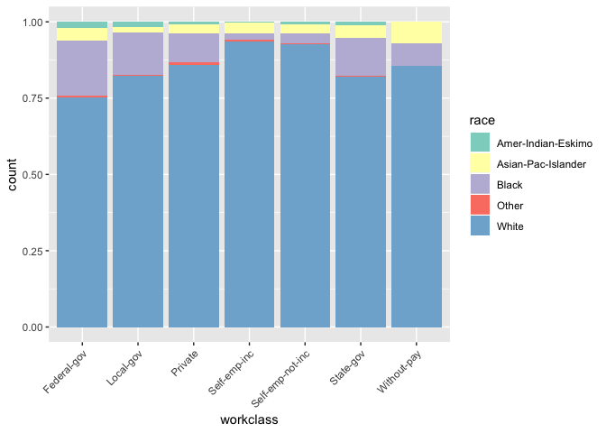

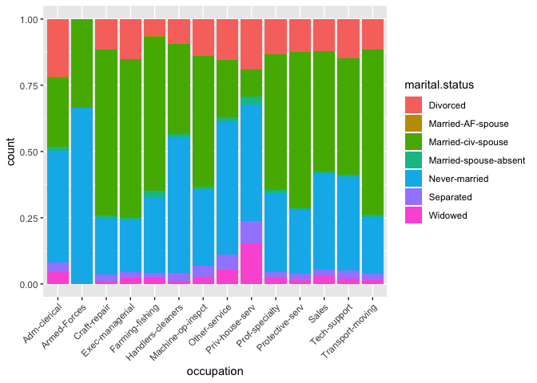

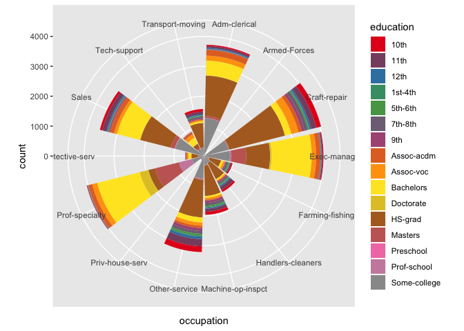

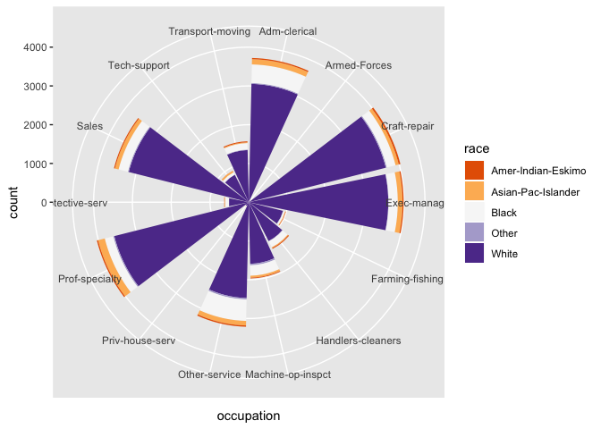

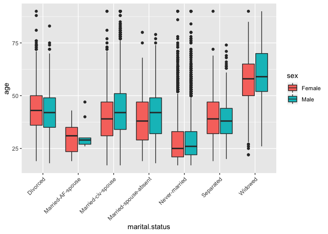
### X Axis Breaks and Labels 
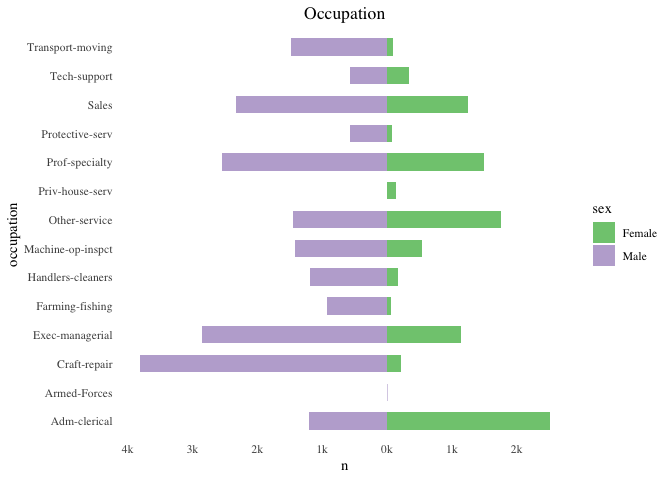

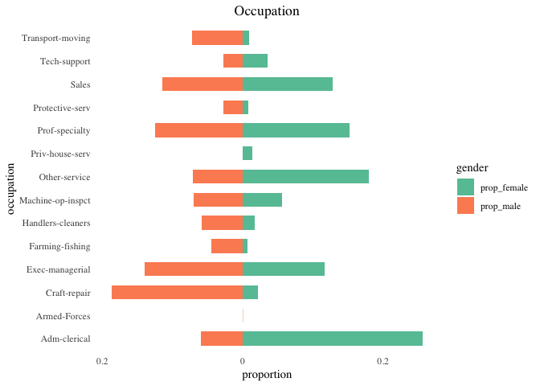

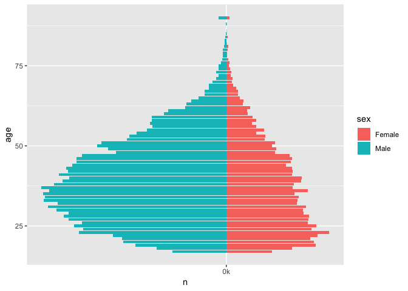

```
> # A tibble: 30,162 x 2
>    occupation        education
>    <fct>             <fct>    
>  1 Adm-clerical      Bachelors
>  2 Exec-managerial   Bachelors
>  3 Handlers-cleaners HS-grad  
>  4 Handlers-cleaners 11th     
>  5 Prof-specialty    Bachelors
>  6 Exec-managerial   Masters  
>  7 Other-service     9th      
>  8 Exec-managerial   HS-grad  
>  9 Prof-specialty    Masters  
> 10 Exec-managerial   Bachelors
> # … with 30,152 more rows
```
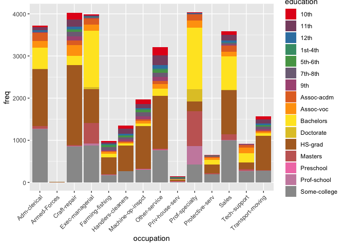


```
> [1] "<=50K" ">50K"
```

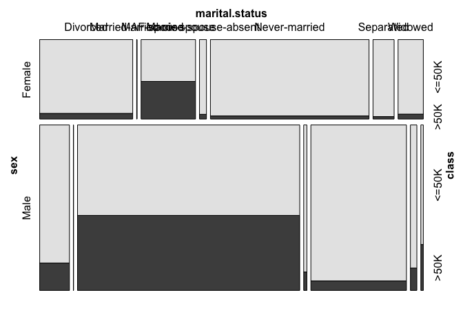
# machine learning 

## logistic regression

```
>  [1] "age"            "workclass"      "education"      "education.num" 
>  [5] "marital.status" "occupation"     "relationship"   "race"          
>  [9] "sex"            "capital.gain"   "capital.loss"   "hours.per.week"
> [13] "native.country" "class"
```

```
>    yesPred
>         0     1
>   0 21070  1584
>   1  2978  4530
```

```
>    yesPred
>         0     1
>   0 10563   797
>   1  1499  2201
```

```
> 0.1512499 0.1524568
```

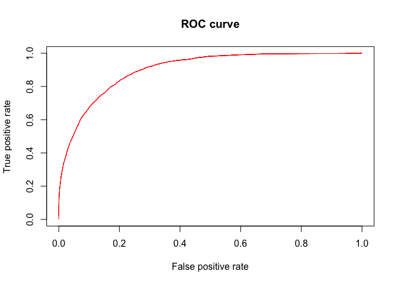

## KNN


```
>        y.test
> knn.reg     1     2
>       1 10267  1379
>       2  1093  2321
```

## tree

```
> Help on topic 'tree' was found in the following packages:
> 
>   Package               Library
>   tree                  /Library/Frameworks/R.framework/Versions/3.5/Resources/library
>   cli                   /Library/Frameworks/R.framework/Versions/3.5/Resources/library
> 
> 
> Using the first match ...
```

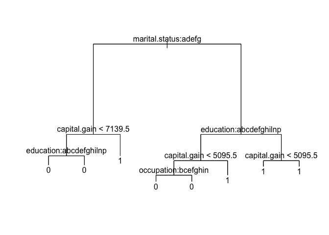

```
> $size
> [1] 8 5 4 3 1
> 
> $dev
> [1] 4815 4815 5091 5575 7508
> 
> $k
> [1]  -Inf   0.0 276.0 484.0 966.5
> 
> $method
> [1] "misclass"
> 
> attr(,"class")
> [1] "prune"         "tree.sequence"
```

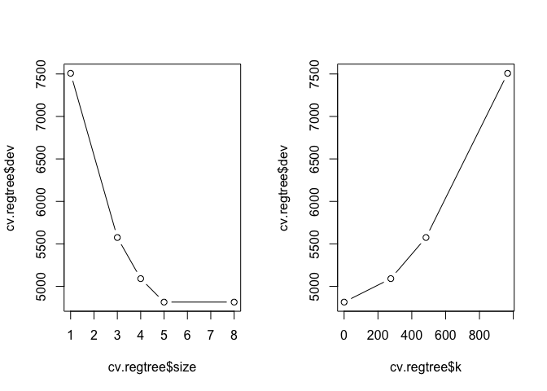
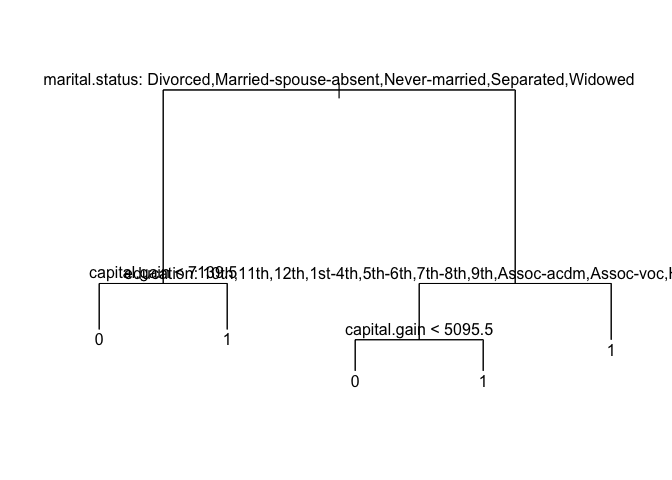

```
>          
> tree.pred     0     1
>         0 10769  1829
>         1   591  1871
```

## bagging 

```
>         
> pred.bag     0     1
>        0 10366  1385
>        1   994  2315
```

```
> [1] 0.1579681
```

## random forest 

```
>        
> pred.rf     0     1
>       0 10540  1332
>       1   820  2368
```

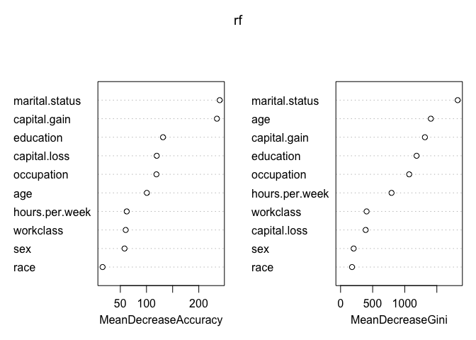
