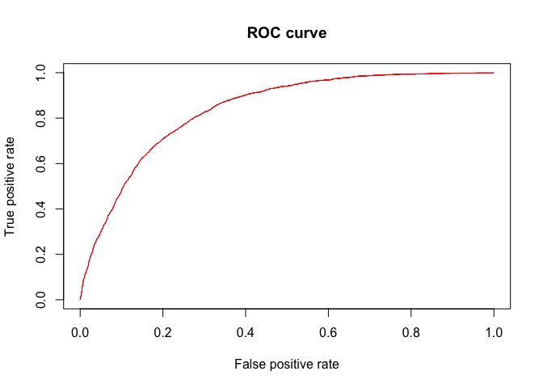
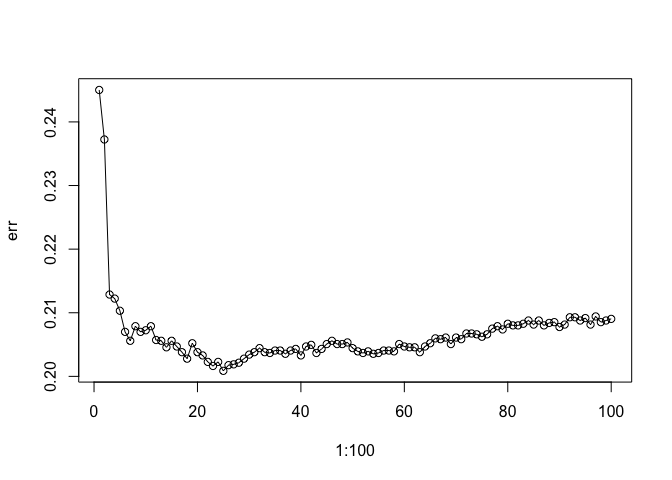
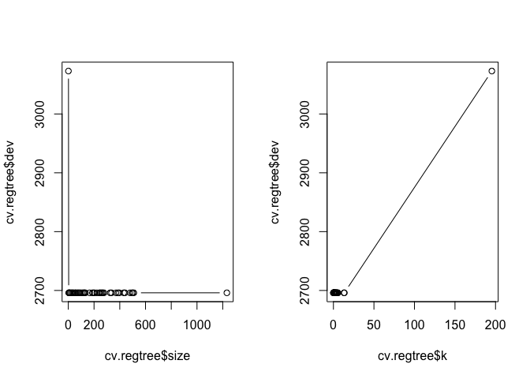
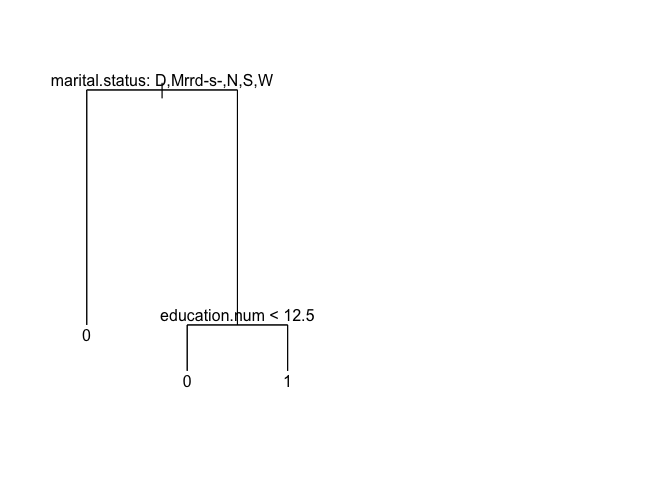
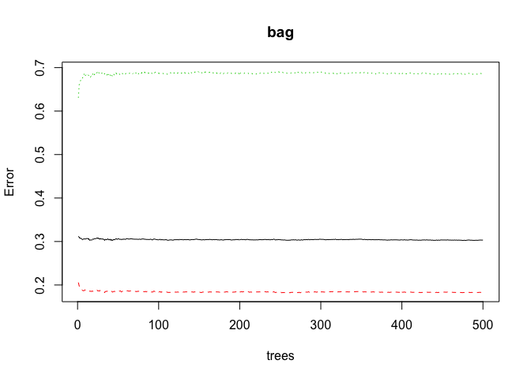
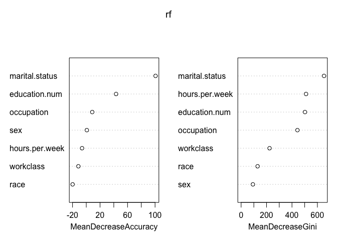

```r
library(ROCR)
library(leaps)
library(glmnet)


log.reg = glm(class ~ ., df.train, family = binomial)
summary(log.reg)
```

```
> 
> Call:
> glm(formula = class ~ ., family = binomial, data = df.train)
> 
> Deviance Residuals: 
>     Min       1Q   Median       3Q      Max  
> -2.2369  -0.6436  -0.3624  -0.1060   3.1091  
> 
> Coefficients:
>                                       Estimate Std. Error z value Pr(>|z|)
> (Intercept)                          -5.544845   0.274266 -20.217  < 2e-16
> workclassLocal-gov                   -0.404252   0.126264  -3.202 0.001366
> workclassPrivate                     -0.304782   0.106842  -2.853 0.004336
> workclassSelf-emp-inc                -0.039861   0.138630  -0.288 0.773703
> workclassSelf-emp-not-inc            -0.419459   0.122848  -3.414 0.000639
> workclassState-gov                   -0.515037   0.136170  -3.782 0.000155
> workclassWithout-pay                -12.061823 126.850232  -0.095 0.924246
> education.num                         0.218874   0.010934  20.017  < 2e-16
> marital.statusMarried-AF-spouse       1.838983   0.480055   3.831 0.000128
> marital.statusMarried-civ-spouse      1.445300   0.072644  19.896  < 2e-16
> marital.statusMarried-spouse-absent  -0.322486   0.209219  -1.541 0.123224
> marital.statusNever-married          -0.599360   0.086684  -6.914 4.70e-12
> marital.statusSeparated              -0.331257   0.150235  -2.205 0.027460
> marital.statusWidowed                 0.089754   0.145943   0.615 0.538556
> occupationArmed-Forces               -0.951296   1.162337  -0.818 0.413109
> occupationCraft-repair                0.131165   0.112642   1.164 0.244244
> occupationExec-managerial             0.616062   0.098011   6.286 3.26e-10
> occupationFarming-fishing            -0.751775   0.157440  -4.775 1.80e-06
> occupationHandlers-cleaners          -0.662034   0.182172  -3.634 0.000279
> occupationMachine-op-inspct          -0.227844   0.148010  -1.539 0.123710
> occupationOther-service              -0.739287   0.133288  -5.547 2.91e-08
> occupationPriv-house-serv            -2.423097   1.048497  -2.311 0.020832
> occupationProf-specialty              0.505017   0.097812   5.163 2.43e-07
> occupationProtective-serv             0.276311   0.146344   1.888 0.059013
> occupationSales                       0.198504   0.107032   1.855 0.063650
> occupationTech-support                0.419275   0.134977   3.106 0.001895
> occupationTransport-moving           -0.064180   0.131494  -0.488 0.625491
> raceAsian-Pac-Islander                0.491562   0.229203   2.145 0.031980
> raceBlack                             0.485208   0.217159   2.234 0.025460
> raceOther                            -0.158890   0.332249  -0.478 0.632491
> raceWhite                             0.649355   0.206072   3.151 0.001627
> sexMale                               0.236487   0.060138   3.932 8.41e-05
> hours.per.week                        0.021066   0.001664  12.658  < 2e-16
>                                        
> (Intercept)                         ***
> workclassLocal-gov                  ** 
> workclassPrivate                    ** 
> workclassSelf-emp-inc                  
> workclassSelf-emp-not-inc           ***
> workclassState-gov                  ***
> workclassWithout-pay                   
> education.num                       ***
> marital.statusMarried-AF-spouse     ***
> marital.statusMarried-civ-spouse    ***
> marital.statusMarried-spouse-absent    
> marital.statusNever-married         ***
> marital.statusSeparated             *  
> marital.statusWidowed                  
> occupationArmed-Forces                 
> occupationCraft-repair                 
> occupationExec-managerial           ***
> occupationFarming-fishing           ***
> occupationHandlers-cleaners         ***
> occupationMachine-op-inspct            
> occupationOther-service             ***
> occupationPriv-house-serv           *  
> occupationProf-specialty            ***
> occupationProtective-serv           .  
> occupationSales                     .  
> occupationTech-support              ** 
> occupationTransport-moving             
> raceAsian-Pac-Islander              *  
> raceBlack                           *  
> raceOther                              
> raceWhite                           ** 
> sexMale                             ***
> hours.per.week                      ***
> ---
> Signif. codes:  0 '***' 0.001 '**' 0.01 '*' 0.05 '.' 0.1 ' ' 1
> 
> (Dispersion parameter for binomial family taken to be 1)
> 
>     Null deviance: 14140  on 12854  degrees of freedom
> Residual deviance: 10649  on 12822  degrees of freedom
> AIC: 10715
> 
> Number of Fisher Scoring iterations: 12
```

```r
prob = fitted.values(log.reg)
yesPred = rep(0, length(prob))
yesPred[prob>0.5] = 1
table(df.train$class, yesPred)
```

```
>    yesPred
>        0    1
>   0 8983  799
>   1 1806 1267
```

```r
trainER.glm = mean(df.train$class != yesPred)

pred.log = predict(log.reg, df.test, type = "response")
yesPred = rep(0, length(pred.log))
yesPred[pred.log>0.5] = 1
table(df.test$class, yesPred)
```

```
>    yesPred
>        0    1
>   0 5469  516
>   1 1048  803
```

```r
testER.glm = mean(df.test$class != yesPred)
cat(trainER.glm, testER.glm)
```

```
> 0.2026449 0.1995916
```

```r
# cv.error = rep(NA, 100)
# for (k in 1:5) {
#   threshold = k/5
#   loss = function(y, p) return(mean (y == 1 & p < threshold)|(y == 0 & p >= threshold))
#   cv.error[k] = cv.glm(df.train,log.reg,loss, K = 1000)$delta[2]
# }
# which.min(cv.error)/20
# 
# cv.glm(df.train,log.reg, K = 10000) # too slow 


full = glm(class ~., df.train, family = "binomial")
null = glm(class ~ 1, df.train, family = "binomial")

reg = step(full, scope = list(lower = null, upper = full), direction = "backward")
```

```
> Start:  AIC=10715.11
> class ~ workclass + education.num + marital.status + occupation + 
>     race + sex + hours.per.week
> 
>                  Df Deviance   AIC
> <none>                 10649 10715
> - sex             1    10665 10729
> - race            4    10675 10733
> - workclass       6    10681 10735
> - hours.per.week  1    10813 10877
> - occupation     13    10919 10959
> - education.num   1    11092 11156
> - marital.status  6    11941 11995
```

```r
reg = step(null, scope = list(lower = null, upper = full), direction = "forward")
```

```
> Start:  AIC=14142.08
> class ~ 1
> 
>                  Df Deviance   AIC
> + marital.status  6    12320 12334
> + education.num   1    12992 12996
> + occupation     13    13104 13132
> + hours.per.week  1    13608 13612
> + sex             1    13796 13800
> + workclass       6    13868 13882
> + race            4    14001 14011
> <none>                 14140 14142
> 
> Step:  AIC=12333.68
> class ~ marital.status
> 
>                  Df Deviance   AIC
> + education.num   1    11232 11248
> + occupation     13    11441 11481
> + hours.per.week  1    12034 12050
> + workclass       6    12191 12217
> + race            4    12246 12268
> + sex             1    12285 12301
> <none>                 12320 12334
> 
> Step:  AIC=11247.82
> class ~ marital.status + education.num
> 
>                  Df Deviance   AIC
> + occupation     13    10923 10965
> + hours.per.week  1    11010 11028
> + workclass       6    11168 11196
> + sex             1    11185 11203
> + race            4    11195 11219
> <none>                 11232 11248
> 
> Step:  AIC=10964.63
> class ~ marital.status + education.num + occupation
> 
>                  Df Deviance   AIC
> + hours.per.week  1    10725 10769
> + sex             1    10884 10928
> + workclass       6    10875 10929
> + race            4    10894 10944
> <none>                 10923 10965
> 
> Step:  AIC=10768.59
> class ~ marital.status + education.num + occupation + hours.per.week
> 
>             Df Deviance   AIC
> + workclass  6    10691 10747
> + race       4    10699 10751
> + sex        1    10706 10752
> <none>            10725 10769
> 
> Step:  AIC=10747.11
> class ~ marital.status + education.num + occupation + hours.per.week + 
>     workclass
> 
>        Df Deviance   AIC
> + race  4    10665 10729
> + sex   1    10675 10733
> <none>       10691 10747
> 
> Step:  AIC=10728.62
> class ~ marital.status + education.num + occupation + hours.per.week + 
>     workclass + race
> 
>        Df Deviance   AIC
> + sex   1    10649 10715
> <none>       10665 10729
> 
> Step:  AIC=10715.11
> class ~ marital.status + education.num + occupation + hours.per.week + 
>     workclass + race + sex
```

```r
pred_reg = ifelse(reg$fitted.values >=0.5, 1, 0)
mean(df.train$class != pred_reg)
```

```
> [1] 0.2026449
```

```r
p1 <- prediction(pred.log, df.test$class) %>%
  performance(measure = "tpr", x.measure = "fpr")
plot(p1, col = "red", main = "ROC curve")
```

<!-- -->

```r
# ridge = glmnet(x.train, as.numeric(y.train), alpha=0, lambda = seq(0,10,0.01))
# summary(ridge)
# lasso = glmnet(x.train, as.numeric(y.train), alpha=1, lambda = seq(0,10,0.01))
# plot(ridge)
# plot(lasso)
```


```r
lda.reg = lda(class ~ ., df.train)
predTrain = predict(lda.reg)$class
table(df.train$class, predTrain)
```

```
>    predTrain
>        0    1
>   0 8916  866
>   1 1750 1323
```

```r
trainER.lda = mean(df.train$class != predTrain)
pred.lda = predict(lda.reg, newdata = df.test)$class
(testER.lda = mean(df.test$class != pred.lda))
```

```
> [1] 0.1993364
```


```r
set.seed(1)
x.train = model.matrix(class~., df.train)[,-1]
y.train = df.train$class
x.test = model.matrix(class~., df.test)[,-1]
y.test = df.test$class

err = c()
for (i in 1:100) {
  knn.reg = class::knn(x.train, x.test, y.train, i)
  err[i] = mean(knn.reg != y.test)
}
which.min(err)
```

```
> [1] 25
```

```r
(testER.knn = min(err))
```

```
> [1] 0.2008678
```

```r
plot(1:100, err) + lines(1:100, err)
```

<!-- -->

```
> integer(0)
```


```r
set.seed(1)
library(tree)
reg.tree = tree(class ~ ., data = df.train, split = "gini")
summary(reg.tree)
```

```
> 
> Classification tree:
> tree(formula = class ~ ., data = df.train, split = "gini")
> Number of terminal nodes:  1232 
> Residual mean deviance:  0.6762 = 7860 / 11620 
> Misclassification error rate: 0.1622 = 2085 / 12855
```

```r
# plot(reg.tree)
# text(reg.tree)
pred.tree = predict(reg.tree, newdata = df.test, type = "class")
(testER.tree = mean(pred.tree != df.test$class))
```

```
> [1] 0.2248596
```

```r
# testER.tree = c()
# for (i in 10:100) {
#   reg.tree = tree(class ~ workclass + education + occupation + race + sex + hours.per.week, data = df.train, split = "gini", control = tree.control(minsize = i))
#   pred.tree = predict(reg.tree, newdata = df.test, type = "class")
#   testER.tree[i] = mean(pred.tree != df.test$class)
# }
# best.minsize = which.min(testER.tree) - 10
# min(testER.tree[!is.na(testER.tree)])

# plot(10:100, testER.tree[10:100]) + lines(10:100, testER.tree[10:100])

cv.regtree = cv.tree(reg.tree, FUN=prune.misclass)
(best = cv.regtree$size[which.min(cv.regtree$dev)])
```

```
> [1] 1232
```

```r
par(mfrow=c(1,2))
plot(cv.regtree$size,cv.regtree$dev,type="b")
plot(cv.regtree$k,cv.regtree$dev,type="b")
```

<!-- -->

```r
cv.regtree$dev
```

```
>  [1] 2696 2696 2696 2696 2696 2696 2696 2696 2696 2696 2696 2696 2696 2696
> [15] 2696 2696 2696 2696 2696 2696 2696 2696 2696 2696 2696 2696 2696 2696
> [29] 2696 2696 2696 2696 2696 2696 2696 2696 2696 2696 2696 2696 2696 2696
> [43] 2696 2696 3073
```

```r
cv.regtree$size
```

```
>  [1] 1232  509  501  495  480  440  430  397  386  371  336  325  277  268
> [15]  263  255  246  242  222  204  196  187  166  133  127  122  116  106
> [29]   94   88   77   74   62   56   52   39   37   27   25   15   11    6
> [43]    5    3    1
```

```r
prune.regtree = prune.misclass(reg.tree, best = 3)
plot(prune.regtree)
text(prune.regtree, pretty = 1)
prunned_tree.pred = predict(prune.regtree, df.test, type = "class")
table(prunned_tree.pred, df.test$class)
```

```
>                  
> prunned_tree.pred    0    1
>                 0 5628 1240
>                 1  357  611
```

```r
(testER.prunned_tree = mean(prunned_tree.pred != df.test$class))
```

```
> [1] 0.203803
```

<!-- -->


```r
library(randomForest)
bag = randomForest(class ~ ., data = df.train, mtry = 7, importance =TRUE)
pred.bag = predict(bag, newdata = df.test)
table(pred.bag, df.test$class)
```

```
>         
> pred.bag    0    1
>        0 5420 1099
>        1  565  752
```

```r
(testER.bag = mean(pred.bag!= df.test$class))
```

```
> [1] 0.2123532
```

```r
plot(bag)
```

<!-- -->


```r
rf = randomForest(class ~ ., data = df.train, importance =TRUE)
rf$confusion
```

```
>      0    1 class.error
> 0 8850  932  0.09527704
> 1 1866 1207  0.60722421
```

```r
pred.rf = predict(rf, newdata = df.test)
table(pred.rf, df.test$class)
```

```
>        
> pred.rf    0    1
>       0 5456  985
>       1  529  866
```

```r
(testER.rf = mean(pred.rf != df.test$class))
```

```
> [1] 0.1932108
```

```r
varImpPlot(rf)
```

<!-- -->

```r
for (m in 1:7) {
rf.m = randomForest( class ~ ., data = df.train, mtry=m)
pred.rf = predict(rf, newdata = df.test)
testER.rf[m] = mean(pred.rf != df.test$class)
}
which.min(testER.rf)
```

```
> [1] 3
```

```r
testER.rf[which.min(testER.rf)]
```

```
> [1] 0.1932108
```

